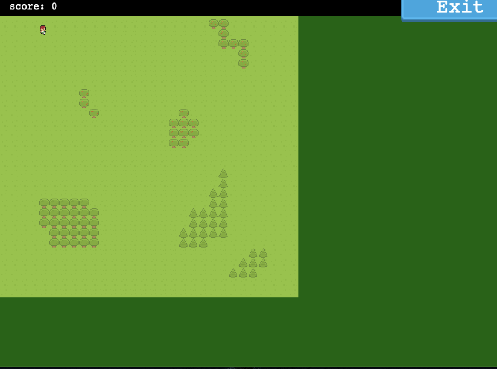
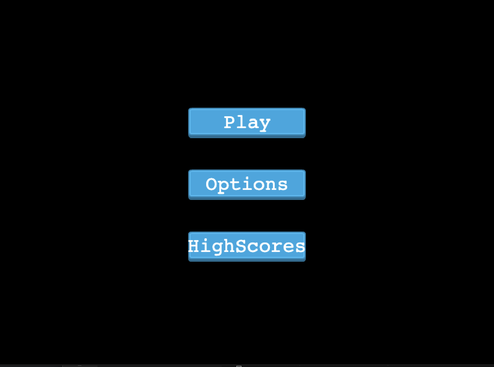
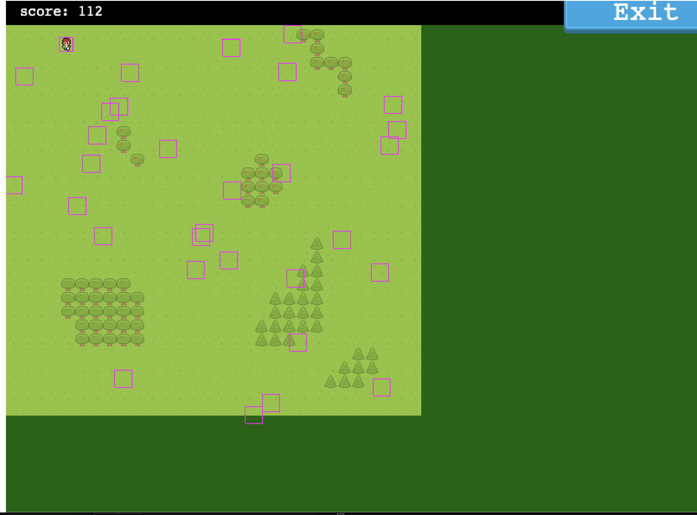

# RPG-GAME

> An RPG game built using the Phaser 3 Framework for the JavaScript capstone project.

# Game Instructions

- Fill your Name and hit Enter
- Click Play Button
- Use Arrow key to move to any direction
- Once you meet the enemy on map the game automatically switch to battle scene.
- Use tab (or space) to kill the enemy on battle scene.
- Once you kill the enemy the game automatically switch to world scene.
- Meet another enemy to continue the game or click the exit button to exit from the game and click Highscore button to see your score.

## Built With

- Javascript
- HTML5
- Phaser 3
- Webpack

## Live Demo

[Live Demo Link](https://addis0943.github.io/RPG-Game2/)

## Getting Started

To set up a local copy of the project

- `git clone git@github.com:Addis0943/RPG-Game2.git`
- `cd RPG-Game2`

If you want to repack the file

- Run `npm install` on the terminal to install dependancies
- Run `npx start` to run the game locally

## Author

👤 **Addis Belete**

- GitHub: [@Addis0943](https://github.com/Addis0943)
- Twitter: [@Addis32018084](https://twitter.com/Addis32018084)
- LinkedIn: [LinkedIn](https://www.linkedin.com/in/addis-belete-134b98191/)

## 🤝 Contributing

Contributions, issues, and feature requests are welcome!

Feel free to check the [issues page](../../issues/).

## Show your support

Give a ⭐️ if you like this project!

## Acknowledgments

- Hat tip to Zil Norvils
- Inspiration
- etc

## 📝 License

This project is [MIT](./MIT.md) licensed.
