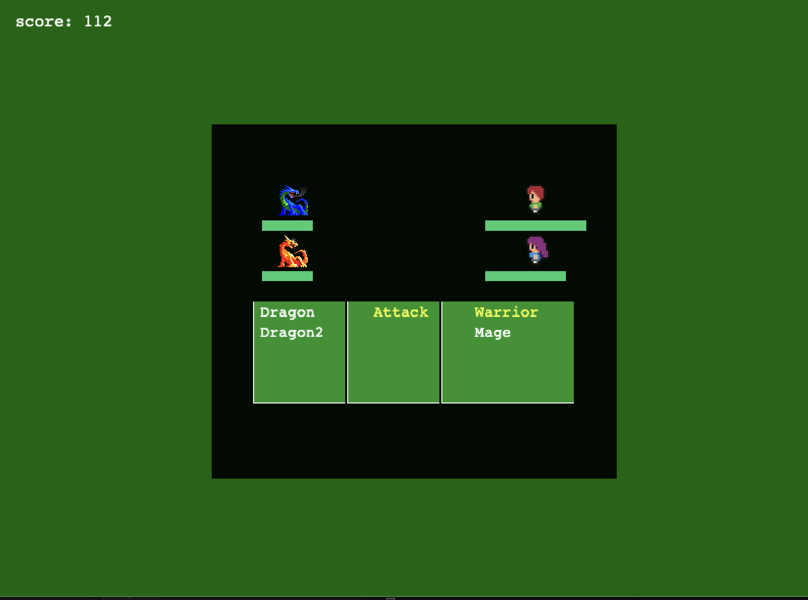

# RPG-GAME

> An RPG game built using the Phaser 3 Framework for the JavaScript capstone project.

# Game Instructions

- Fill your Name and hit Enter
- Click Play Button
- Use Arrow key to move to any direction
- Once you meet the enemy on map the game automatically switch to battle scene.
- Use tab (or space) to kill the enemy on battle scene.
- Once you kill the enemy the game automatically switch to world scene.
- Meet another enemy to continue the game or click the exit button to exit from the game and click Highscore button to see your score.

## Game Design

This is a turn-based role-playing game(RPG). In the game there are two main characters: A warrior and A mage, they travel the world and fight dragons. To navigate in the world scene, the player uses keyboard arrows up, down, left, right. In the battle scene, use keyboard arrows up, down, left, and space bar to attack the chosen enemy. Inside the battle, the scene player can see his characters' and enemies' health bars at all times. Also there are player's score available to see in the top bar in both of the scenes, when player want to quit, he can use the button 'Exit' in the top right of the bar, after clicking said button player is taken to High Score scene, where all top players and their scores are listed.

## Built With

- Javascript
- HTML5
- Phaser 3
- Webpack

## Live Demo

[Live Demo Link](https://addis0943.github.io/RPG-Game2/)

## Getting Started

To set up a local copy of the project

- `git clone git@github.com:Addis0943/RPG-Game2.git`
- `cd RPG-Game2`

If you want to repack the file

- Run `npm install` on the terminal to install dependancies
- Run `npx run bundle`
- Open `index.hmtl ` with live server

If you want to test the code

- Run `npm run test`

## Author

👤 **Addis Belete**

- GitHub: [@Addis0943](https://github.com/Addis0943)
- Twitter: [@Addis32018084](https://twitter.com/Addis32018084)
- LinkedIn: [LinkedIn](https://www.linkedin.com/in/addis-belete-134b98191/)

## 🤝 Contributing

Contributions, issues, and feature requests are welcome!

Feel free to check the [issues page](../../issues/).

## Show your support

Give a ⭐️ if you like this project!

## Acknowledgments

- Hat tip to Zil Norvils
- Inspiration
- etc

## 📝 License

This project is [MIT](./MIT.md) licensed.
